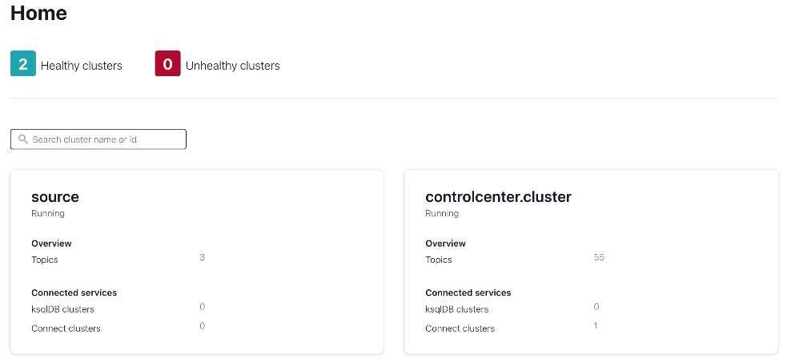
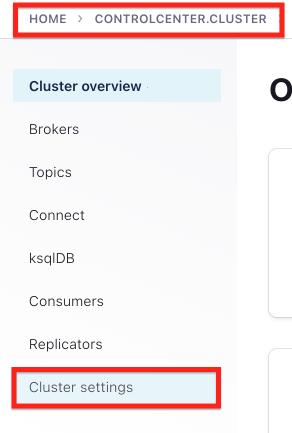
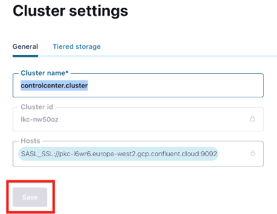
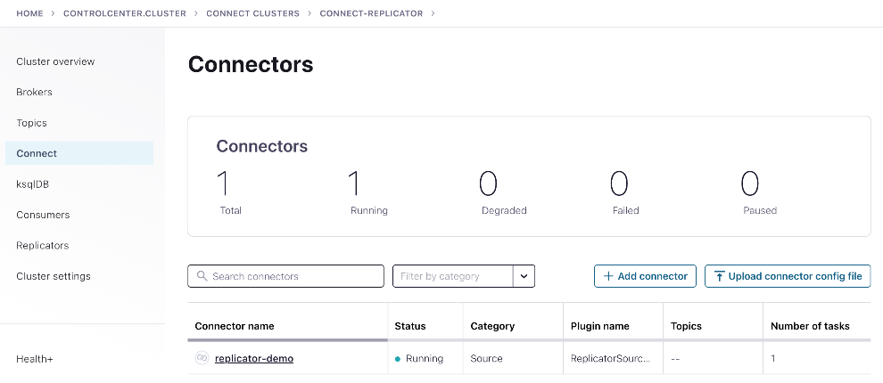
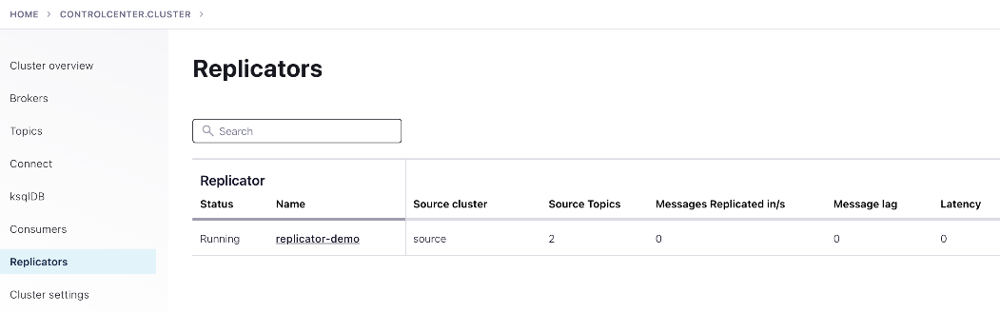
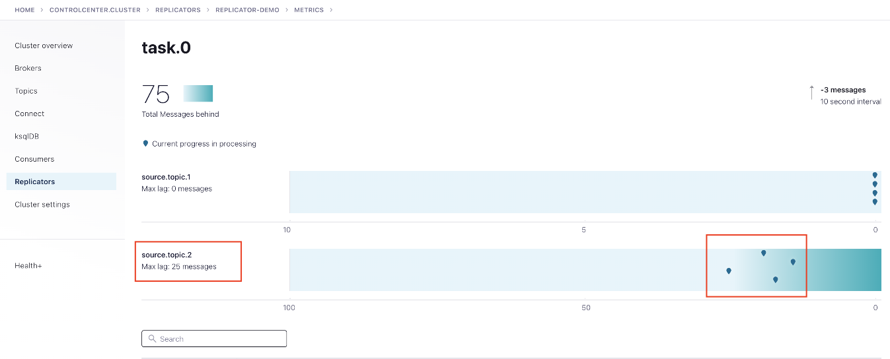
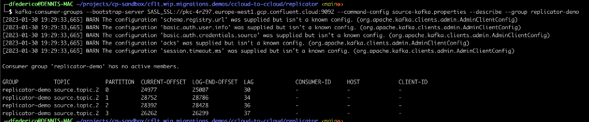

# CCloud-to-CCloud migration

TODO... Intro/Why? when moving from marketplace to PAYGO, etc.. whether the clusters are visible between them or not (i.e. public vs private link)

## Scenarios

- [CCloud-to-CCloud migration](#ccloud-to-ccloud-migration)
  - [Scenarios](#scenarios)
    - [Replicator Without Offset Translation](#replicator-without-offset-translation)
      - [Spin Connect with Docker Compose](#spin-connect-with-docker-compose)
      - [Generate Data in one or more source cluster topics](#generate-data-in-one-or-more-source-cluster-topics)
      - [Deploy Replicator](#deploy-replicator)
      - [Monitoring Replicator with Control Center](#monitoring-replicator-with-control-center)
      - [Monitor Replicator from the REST endpoint](#monitor-replicator-from-the-rest-endpoint)
      - [Monitor Replicator with Command-line](#monitor-replicator-with-command-line)
      - [Consuming replicated data](#consuming-replicated-data)
      - [Simulate replication LAG](#simulate-replication-lag)
    - [Replicator With Offset Translation](#replicator-with-offset-translation)
  - [Other commands](#other-commands)

---

### Replicator Without Offset Translation

TODO... Intro, Why, etc...

#### Spin Connect with Docker Compose

The provided [docker/docker-compose.yml](docker/docker-compose.yml) contains a sample configuration of a Kafka Connect node and Confluent Control Center to manage this single-node connect cluster. Both Kafka Connect and C3 are configured with the Target cluster as backend, make sure you have "created" the `.env` with the configuration and credentials from [terraform](../terraform/README.md)

```properties
#CONTENT EXAMPLE OF .env FOR DOCKER COMPOSE
REPOSITORY=confluentinc
CONFLUENT_DOCKER_TAG=7.3.1-1-ubi8
SOURCE_CLUSTER_BOOTSTRAP=<source-bootstrap>
SOURCE_CLUSTER_REST_URL=<source-rest>
SOURCE_CLUSTER_OWNER_API_KEY=
SOURCE_CLUSTER_OWNER_API_SECRET=
TARGET_CLUSTER_BOOTSTRAP=<target-bootstrap>
TARGET_CLUSTER_REST_URL=
TARGET_CLUSTER_OWNER_API_KEY=
TARGET_CLUSTER_OWNER_API_SECRET=
TARGET_SCHEMA_REGISTRY_URL=<schema-registry-url>
TARGET_SCHEMA_REGISTRY_API_KEY=
TARGET_SCHEMA_REGISTRY_API_SECRET=
```

Run `docker compose up -d` and wait for the services to spin up.
If you want to check the logs, run `docker compose logs -f control-center` or `docker compose logs -f connect-replicator`

Open Control-Center in you brower [http://localhost:9021](http://localhost:9021)



The target cluste is sometimes named ("CONTROLCENTER.CLUSTER"), this can be changed in the cluster settings section for the selected cluster



*Note:* The save button enables after you change the value in the name field



Note the "target/controlcenter.cluster" contains a connect cluster.

#### Generate Data in one or more source cluster topics

***Note:*** Make sure to create the connection properties file for the source and target cluster that you can later use for console commands or test applications

Option 1. To generate a sequence of numbers using `kafka-console-producer`:

```bash
seq 100000 | kafka-console-producer --bootstrap-server SASL_SSL://pkc-4r297.europe-west1.gcp.confluent.cloud:9092 --producer.config source-kafka.properties --topic source.topic.2
```

Option 2. Generate random data at a constant rate using `kafka-producer-perf-test`

```bash
kafka-producer-perf-test --producer.config source-kafka.properties --topic source.topic.2 --record-size 100 --throughput 10 --num-records 3000
```

#### Deploy Replicator

Run the script `submit-replicator.sh` from the terraform setup (see. [terraform/README.md](../terraform/README.md))

This script will send a json configuration payload to the connector cluster http endpoint

```json
# REPLICATOR (JSON) CONFIGURATION EXAMPLE 
{
  "name": "replicator-demo",
  "config": {
    "name": "replicator-demo",
    "connector.class": "io.confluent.connect.replicator.ReplicatorSourceConnector",
    "tasks.max": "1",
    "topic.regex": "source.topic.*",
    "key.converter": "io.confluent.connect.replicator.util.ByteArrayConverter",
    "value.converter": "io.confluent.connect.replicator.util.ByteArrayConverter",
    "topic.auto.create": "true",
    "topic.preserve.partitions": "true",
    "offset.translator.tasks.max": "0",
    "offset.timestamps.commit": "false",

    "src.consumer.group.id": "replicator-demo",
    "src.kafka.bootstrap.servers": "...",
    "src.kafka.security.protocol": "SASL_SSL",
    "src.kafka.sasl.mechanism": "PLAIN",
    "src.kafka.sasl.jaas.config": "...",

    "dest.kafka.bootstrap.servers": "...",
    "dest.kafka.security.protocol": "SASL_SSL",
    "dest.kafka.sasl.mechanism": "PLAIN",
    "dest.kafka.sasl.jaas.config": "..."
  }
}
```

```bash
sh submit-replicator.sh
```

#### Monitoring Replicator with Control Center

The Replicator deploys as any connector in the Connect Cluster



But also the replication rest extension provided in the connect cluster allows Control Center to show specific replicator metrics (i.e. lag) in the Replicator tab





#### Monitor Replicator from the REST endpoint

From the Connect perspective, you can query the status of the replicator as a connector using like this: (assuming `jq` is installed to pretty-print json responses)

```bash
curl -s -X GET http://localhost:8083/connectors/replicator-demo/status | jq
```

The replicator rest extension provides a couple of endpoints to check the status of a replicator or the workers involved

```bash
curl -s -X GET http://localhost:8083/WorkerMetrics/replicator-demo | jq
curl -s -X GET http://localhost:8083/ReplicatorMetrics | jq
```

NOTE that the output show the replication state for each topic-partition, being `messageLag` the most important metric for each.

#### Monitor Replicator with Command-line

By default replicator commits consumed offset in the source cluster as any other consumer group, as long as it not configured to change/override the partition count on the destination cluster. The consumer group id is configured in the replicator connector by `src.consumer.group.id`

```bash
kafka-consumer-groups --bootstrap-server <source-cluster-bootstrap> --command-config source-kafka.properties --list
kafka-consumer-groups --bootstrap-server <source-cluster-bootstrap> --command-config source-kafka.properties --describe --group replicator-demo
```



#### Consuming replicated data

```bash
kafka-console-consumer --bootstrap-server pkc-l6wr6.europe-west2.gcp.confluent.cloud:9092 --consumer.config target-cluster.properties --topic source.topic.2 --from-beginning
```

#### Simulate replication LAG

The easiest way in this example to emulate some replication lag is to "Pause" the replicator from the Connect tab. Produce data using to the topics under replication and "Resume" the connector, the from the `Replicator` tab in C3, cheking the `Rest endpoint` or using `kafka-consumer-groups` you will the lag value changing as the replicator gets up-to-date.


---

### Replicator With Offset Translation

ABOUT OFFSET TRANSLATION
https://docs.confluent.io/platform/current/multi-dc-deployments/replicator/replicator-failover.html#understanding-consumer-offset-translation

https://docs.confluent.io/platform/current/multi-dc-deployments/replicator/replicator-failover.html#advanced-configuration-for-failover-scenarios-tuning-offset-translation

---

## Other commands

- Delete Connector

```bash
curl -X DELETE http://localhost:8083/connectors/replicator-demo`
```

- List Connector Log Level

```bash
curl -s http://localhost:8083/admin/loggers/ | jq
```

- Modify Connect Log level without restart

```bash
curl -s -X PUT -H "Content-Type:application/json" http://localhost:8083/admin/loggers/io.confluent.connect.replicator -d '{"level": "TRACE"}'
```

- Describe topics

```bash
kafka-topics --bootstrap-server <cluster-bootstrap> --command-config <cluster-connection.properties> --describe --topic <topic.name>
```
