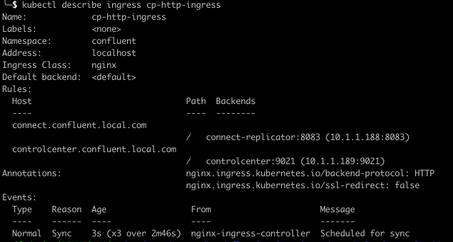

# Quick instructions for Deployment with CFK

Includes Connect cluster for replicator and C3 for management
TODO... ingress for C3, workaround: `kubectl port-forward`

**Pre-requesites**:

- Kubernetes cluster (local env: k3d / docker for desktop)
- kubectl (configured for the above)
- Helm (to install CFK)

## Setup Operator (CFK)

Create namespace:
`kubectl create namespace confluent`

Install Operator:

```bash
helm repo add confluentinc https://packages.confluent.io/helm
helm repo update
helm upgrade --install confluent-operator confluentinc/confluent-for-kubernetes --namespace confluent
```

## Credentials

- Create files with Terraform: (see. [Prepare CFK variables](../../terraform/README.md#prepare-cfk-variables))

```bash
# From terraform folder
terraform output -raw cfk_secrets_source_cluster> ../replicator/cfk/cfk-source-cluster-creds.txt
terraform output -raw cfk_secrets_target_cluster > ../replicator/cfk/cfk-target-cluster-creds.txt
terraform output -raw cfk_secrets_schema_registry > ../replicator/cfk/cfk-sr-cluster-creds.txt
```

- Create secrets in k8s

```bash
kubectl -n confluent create secret generic ccloud-source-credentials --from-file=plain.txt=cfk-source-cluster-creds.txt
kubectl -n confluent create secret generic ccloud-target-credentials --from-file=plain.txt=cfk-target-cluster-creds.txt
kubectl -n confluent create secret generic ccloud-sr-credentials --from-file=basic.txt=cfk-sr-cluster-creds.txt
```

## Platform CRD

Prepare deployment CRD yaml file from the provided [template](cp-platform.yaml.template) using `Kustomize`

- Prepare the kustomize path files with Terraform: (see. [Prepare CFK variables](../../terraform/README.md#prepare-cfk-variables))

```bash
# From terraform folder
terraform output -raw k8s_kustomize_connect > ../replicator/cfk/platform-template/kustomize-connect.yaml
terraform output -raw k8s_kustomize_controlcenter > ../replicator/cfk/platform-template/kustomize-controlcenter.yaml
terraform output -raw k8s_kustomize_connector > ../replicator/cfk/connector-template/kustomize-replicator.yaml
```

- Kustomize and deploy the platform CRD

```bash
# From /replicator/cfk folder
kubectl kustomize platform-template/ > cp-platform.yaml
kubectl apply -f cp-platform.yaml
```

- Open Control Center Dashboard

```bash
# KUBECTL port-forward works good in a local deployment, but it blocks the commandline. An Ingress is a better alternative
kubectl port-forward controlcenter-0 9021:9021 -n confluent
open http://localhost:9021
```

- Kustomize and Deploy the Replicator/Connector CRD

```bash
# From /replicator/cfk folder
kubectl kustomize connector-template/ > replicator.yaml
kubectl apply -f replicator.yaml
```

- (Optional) Deploy Replicator Connector as JSON from Control Center

Use control center to deploy the replicator connector from the Json file built using terraform

```bash
# From terraform folder
terraform output -raw replicator_connector_json > ../replicator/cfk/connector-replicator.json
```

- (Optional) Ingress Controller

Control Center UI and Connect endpoint could also be access via an Ingress Controller instead of port-forwarding to the inside of the K8s cluster

First you need to install an Ingress Controller to you cluster (i.e. NGINX):

```bash
helm repo add ingress-nginx https://kubernetes.github.io/ingress-nginx
helm repo update
helm upgrade  --install ingress-nginx ingress-nginx/ingress-nginx -n confluent

## NOTE: Make sure that the chart version is at least +4.2.1 and App version +1.3.0 (using helm ls command)
```

Second, the pods of each component need to be *bootstrapped* as service for the ingress controller to redirect to any of them, luckily CFK already creates such service as `ClusterIP` with appropiate selectors...

```bash
kubectl describe svc connect
kubectl describe svc controlcenter
```

Third, Deploy and Ingress rule to redirect traffic to the services from outside the K8s cluster (see [optional-http-ingress.yaml](optional-http-ingress.yaml))

```bash
kubectl apply -f optional-http-ingress.yaml
```

You can check the status of the ingress controller using `kubectl describe ingress cp-http-ingress`, notice the "hosts" for each service, these need to be added to your `hosts` file (or DNS) for resolution.



Fourth, Add the following entries to `/etc/hosts` on linux/macOs systems or `C:\Windows\System32\Drivers\etc\hosts` on Windows systems (need Admin rights)

```text
127.0.0.1 connect.confluent.local.com
127.0.0.1 controlcenter.confluent.local.com
```

You can now open control center using [http://controlcenter.confluent.local.com](http://controlcenter.confluent.local.com) or `curl` to connect from outside kubernetes to deploy or query connector (replicator) state [http://connect.confluent.local.com/connectors](http://connect.confluent.local.com/connectors)
